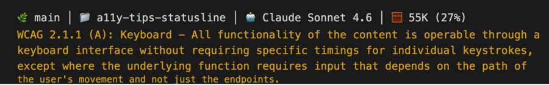

# a11y-tips-statusline

WCAG Accessibility Tips for Claude Code - displays rotating accessibility guidelines in your statusline.



## Features

- 🎯 **87 WCAG 2.2 success criteria** - Complete coverage of all WCAG 2.2 guidelines (Level A, AA, and AAA)
- 🔄 **Random tips** - New accessibility tip every 30 seconds
- 🎨 **Color-coded** - Tips displayed in yellow (256-color mode) for visibility
- 📊 **Full statusline** - Includes directory, model, git branch, and token usage
- 🔍 **Search command** - `/wcag` slash command to search criteria

## Installation

**Works on:** macOS, Linux, and Windows (via WSL)

```bash
curl -fsSL https://raw.githubusercontent.com/mpaiva/a11y-tips-statusline/main/install.sh | bash
```

### Requirements

- [Claude Code](https://claude.ai/code) CLI
- `bash` - Bourne Again Shell (pre-installed on macOS, Linux, WSL)
- `jq` - JSON processor
- `curl` - URL transfer tool
- UTF-8 terminal support (for emojis and special characters)

**Install dependencies:**

| Platform | jq | curl |
|----------|-----|------|
| macOS | `brew install jq` | Pre-installed |
| Ubuntu/Debian | `sudo apt install jq` | `sudo apt install curl` |
| Fedora | `sudo dnf install jq` | `sudo dnf install curl` |
| Arch Linux | `sudo pacman -S jq` | `sudo pacman -S curl` |
| Windows (WSL) | `sudo apt install jq` | `sudo apt install curl` |

## What You'll See

```
📁 my-project │ 🤖 Opus 4.5 │ 🧮 52K (26%)
WCAG 1.4.3 (AA): Contrast (Minimum) - The visual presentation of text and images of text has a contrast ratio of at least 4.5:1, except for the following:
```

The statusline shows:
- 📁 Current directory name
- 🌿 Git branch (when in a repo)
- 🤖 Current Claude model
- 🧮 Token usage and percentage
- Yellow WCAG tip on its own line

## /wcag Search Command

Search WCAG criteria directly from Claude Code:

```bash
/wcag contrast        # Search by keyword
/wcag 1.4.3           # Lookup by criterion ID
/wcag level:AA        # Filter by conformance level
/wcag level:A focus   # Combined: level filter + keyword
```

### Examples

**Find contrast-related criteria:**
```
/wcag contrast
```

**Look up a specific criterion:**
```
/wcag 2.1.1
```
Returns WCAG 2.1.1 (A): Keyboard - All functionality is available from a keyboard...

**List all Level AAA criteria:**
```
/wcag level:AAA
```

## Uninstall

```bash
curl -fsSL https://raw.githubusercontent.com/mpaiva/a11y-tips-statusline/main/uninstall.sh | bash
```

## Customization

### Change tip color

Edit `~/.claude/statusline.sh` and modify:

```bash
a11y_color=$'\033[38;5;178m'  # Yellow (color 178)
```

Common 256-color codes:
- `178` - Yellow/Gold
- `46` - Green
- `39` - Cyan
- `213` - Pink
- `208` - Orange

### Disable color

To show tips without color, change:

```bash
colored_tip="${a11y_color}${a11y_tip}${reset_color}"
```

To:

```bash
colored_tip="$a11y_tip"
```

## WCAG Guidelines Included

All 87 success criteria from WCAG 2.2 are included, organized by principle:

| Principle | Guidelines | Success Criteria |
|-----------|------------|------------------|
| 1. Perceivable | 1.1-1.4 | 29 criteria |
| 2. Operable | 2.1-2.5 | 29 criteria |
| 3. Understandable | 3.1-3.3 | 17 criteria |
| 4. Robust | 4.1 | 12 criteria |

Coverage includes all conformance levels:
- **Level A** - Essential accessibility
- **Level AA** - Standard accessibility (legal compliance target)
- **Level AAA** - Enhanced accessibility

## Contributing

### Data Source

The WCAG data comes from `wcag-search.json`, a structured JSON file containing the complete WCAG 2.2 specification with all success criteria, their levels, and descriptions.

### Submitting Changes

1. Fork the repository
2. Create a feature branch
3. Submit a pull request

## License

MIT License - See [LICENSE](LICENSE) for details.

## Credits

- WCAG Guidelines: [W3C Web Content Accessibility Guidelines](https://www.w3.org/WAI/standards-guidelines/wcag/)
- Created by [@mpaiva](https://github.com/mpaiva)
